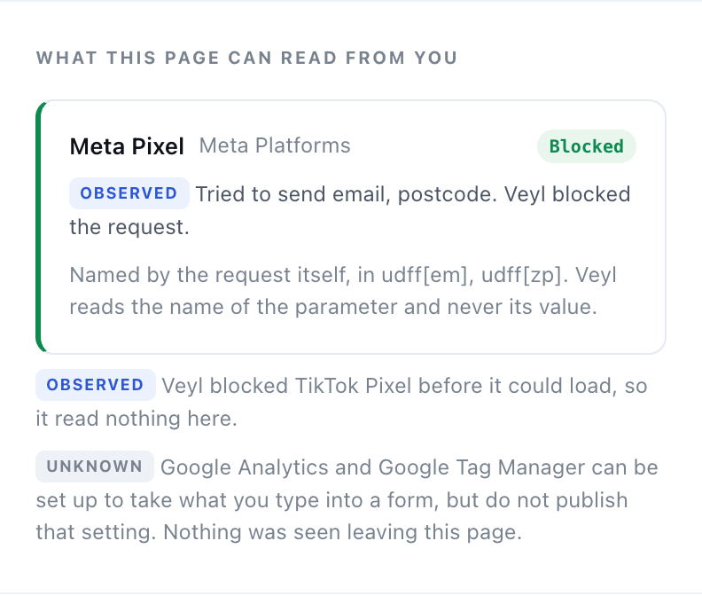

# Using Veyl

A short tour of what Veyl shows you and what to do with it. Every picture here comes
from a synthetic test page built for this purpose — no real browsing appears in any of
them.

---

## Installing it

**[Add Veyl to Chrome](https://chromewebstore.google.com/detail/dnedpkkepgoclefdfeblncgfjpmebbno)** from the Chrome Web Store.

If you would rather build it yourself:

1. Run `npm install && npm run build` in a clone.
2. Open `chrome://extensions` and turn on **Developer mode** (top right).
3. Click **Load unpacked** and choose the `dist` folder.

Veyl's settings page opens once, explaining what it does. You can reopen it any time by
right-clicking the Veyl icon and choosing **Options**.

---

## Letting Veyl see a site

Veyl asks for nothing when you install it. It genuinely cannot see any website until you
say so — Chrome enforces that, not Veyl.

Open a website, click the Veyl icon, and you will see this. Click **Allow Veyl on
\<site\>**; Chrome asks for permission for that one site, and the page reloads so Veyl
can watch the visit from its very first request.

If you would rather have it always on, open Veyl's settings and turn on **Watch every
site**. Chrome will warn that Veyl can read your data on all websites — that warning is
about what the permission *allows*, not what Veyl does with it. What it actually does is
in [the privacy policy](../PRIVACY.md) and in the source.

> **Tip.** Veyl only sees a page it was watching as it loaded. If you granted permission
> and the report says "reload to watch this visit", that is why.

---

## Reading the report

Click the icon again and the report opens as a **side panel** beside the page. It stays
there while you browse and re-reads each page you visit, so you can leave it open rather
than fetching it a click at a time. Close it with the × in its corner.

The top line is the site and its **exposure level** — one of *none seen*, *low*,
*medium*, *high*, or *unknown*. Underneath, one sentence about what that means, then the
counts for what just happened on this page.

The icon in your toolbar carries the same thing at a glance: a coloured badge with the
number of tracking services, or the number of requests blocked when protection is on.

### What this page can read from you

Advertising pixels can be configured to lift your email address, name, phone number,
postcode and date of birth out of any form on the page. Veyl reads that setting — from
the tracker's own configuration, not from the site's policy — so it can tell you before
you type anything.

Three different things can be said here, and Veyl keeps them apart:

- **Declared** — the tracker publishes which fields it will take, and they are listed.
- **Observed** — a request left the page carrying a parameter that *names* personal
  data, such as `udff[em]`. Veyl reads the name of the parameter and never its value.
- **Unknown** — the tracker can be set up this way but does not publish the setting.
  Not the same as "it doesn't". Veyl will not guess.

A tracker Veyl **blocked** is reported as blocked, not as unknown: it never loaded, so
it read nothing.

### Exposure, dimension by dimension

Seven dimensions, each with its own level. Click any one to open it and see the
statements behind it — and click **"Why is Veyl telling me this?"** under a statement to
see the specific evidence, right down to which domain made how many requests.

Two words are used precisely, and the difference matters:

| | |
|---|---|
| **NONE SEEN** | Veyl was watching and saw nothing. It is not proof that nothing happened. |
| **UNKNOWN** | Veyl could not look, or cannot establish it. It is not a quiet way of saying "low". |

Every statement is tagged with where it came from:

| Tag | Meaning |
|---|---|
| **Observed** | Veyl watched this happen in your browser. |
| **Declared** | The site claims this in its own published policy. |
| **Inferred** | Veyl concluded this from what a known service does. |
| **Unknown** | Veyl cannot establish this and will not guess. |

**Confidence** is the last row, and it is a claim about Veyl rather than about the site.
Open it to see why — usually because some domains were not recognised, or because the
site's policy has not been read.

### What they may know

The plain-language version: what the services on this page are able to learn about you,
each one tagged with how Veyl knows.

### Who your browser contacted

Every company your browser reached, most active first. Open any one for what it is, what
it can learn here, exactly what was observed, and — importantly — what that observation
does *not* establish.

Services a page genuinely needs are grouped at the bottom and marked **Kept**. Sign-in,
payments, bot protection, cookie banners and content delivery live there, and Veyl never
blocks them.

### What they say vs what they do

Veyl fetches the site's own policies — the privacy policy and, where one exists, the
separate cookie policy. Your browser does the fetching and they are read on your device.
Veyl then checks what they say against what actually happened.

- **Possible discrepancy** — the policy makes a promise the behaviour contradicts.
- **Worth knowing** — not a contradiction, but something you would want to know.
- **Matches the policy** — the site behaved as written, which is often the more
  uncomfortable finding.

Veyl is careful here. It will tell you that advertising trackers loaded and that the
policy permits sharing with advertising partners. It will not tell you the site *sold*
your data, because that turns on contracts no browser extension can see.

### The policy itself

Four questions answered at a glance, then the collection categories, your rights, and
every claim Veyl extracted with the sentence it came from — so you can check its
reading against the original.

### Cookies

Split into cookies Veyl can name — with what each is for and how long it lasts — and
cookies it cannot, which are reported as unidentified rather than guessed at.

### What Veyl cannot tell you

A permanent part of the report, not an afterthought. What happens to data after it
leaves your browser, whether a company linked the visit to your identity, what a site
forwards from its own servers — none of that is visible to any extension, and Veyl says
so instead of implying otherwise.

---

## Turning on protection

Three levels, set globally in settings and overridable for any single site from here.

| Level | What it does |
|---|---|
| **Watching only** | Explains everything, changes nothing. |
| **Protected** (default) | Blocks advertising, ad measurement and session recording. Strips campaign tracking codes from links you open. Sends Global Privacy Control. |
| **Strict** | Also blocks analytics, tag managers, social tracking and marketing tools. Some chat widgets will not load. |

**Never blocked, at any level:** sign-in, payments, bot and fraud protection, cookie
banners, and content delivery. A privacy tool that breaks your checkout has not
protected you. Nor is a site ever stopped from loading its own files, whatever its
domain is otherwise known for.

When something has been blocked, Veyl tells you exactly what and reminds you that
nothing needed for sign-in or checkout was touched.

> **If a site misbehaves,** set it to **Watching only** from this control. It takes
> effect immediately and Veyl keeps explaining without changing anything.

---

## Asking questions

Where Chrome provides its built-in on-device model, you can ask about the page in your
own words. Chrome runs the model locally; your question never leaves your computer.

**"Explain this site's cookie policy"** is the one most people want. Veyl reads both the
privacy policy and the separate cookie policy where a site has one — which is usually
where the answers actually live — so it can tell you the categories the site uses, how
long its cookies last, who else sets them, and how to change your mind. It will also
say where that account differs from what it watched happen.

The model is shown a summary of the findings already on your screen — never the page
address, never the page content — and it is there to phrase evidence, not to decide
anything. The levels, the companies and the policy findings all come from what Veyl
observed.

If the panel is not there, Chrome has no model available on your device. Everything else
works exactly the same. Veyl's settings page reports the status.

---

> **Want it full width?** *Open in a tab* at the bottom of the report opens the same
> thing in a tab of its own. Unlike the panel it stays pinned to the page you were on,
> so it will not change under you while you read it.

## What Veyl draws on the page

The toolbar icon always carries the exposure level. Because an icon in a corner is not
something anyone notices while reading, Veyl can also mark the page itself — sparingly.

- A **note in the corner** when the page is high exposure, saying what made it high —
  fingerprinting, cross-site activity, how long the data is kept — and the counts behind
  it. It also appears for two specific findings: a tracker here is set up to read what
  you type, or something personal was seen leaving the page.
- A **hairline** along the top of the page, coloured by exposure level. Three pixels, no
  text, and it never moves the page around. It is what remains after you close the note.

Close the note with the × or the Escape key and it stays closed on that page. The
hairline stays behind as the quiet version of the same fact.

**Not on this site** silences both for that site until you close your browser. You can
change what fires, or turn it off entirely, under **On the page** in Settings.

## Settings

- **Where Veyl can look** — per-site access, or all sites.
- **Protection** — your default level, Global Privacy Control, and whether Veyl reads
  published privacy policies.
- **On the page** — what, if anything, Veyl draws on the page you are reading: never,
  only when something personal leaves, high exposure (the default), or medium and above.
  Separately, whether to warn you before you type into a form that a tracker here is
  configured to read.
- **Privacy history** — off unless you turn it on. Counters only, for the current month:
  no list of sites, no domains, no hashes of domains, no timestamps. Erase it in one
  click.
- **What leaves this device** — the full table. The short version is *nothing*.

---

## Worked example

You open a shopping page and the badge shows **7** on an amber background. Clicking
through:

- **Right now** — 6 cookies, 7 tracking services, 5 companies contacted.
- **Advertising: HIGH** — Meta Pixel, Google Ads, Criteo and TikTok Pixel all loaded.
- **What they say vs what they do** — the policy promises only strictly necessary
  cookies before you consent, and seven services had already been contacted before the
  banner was answered. Marked **possible discrepancy**, with the site's own sentence
  quoted next to what was observed.
- **What Veyl cannot tell you** — whether any of those companies connected the visit to
  your identity, and whether anything was legally "sold".

You set protection to **Protected**. Reload, and the badge turns green with the number
of requests blocked; the page still works, because everything the shop needs to run was
left alone.

---

## Questions

Anything unclear, or a site that misbehaves with protection on:
<https://github.com/dev-amjad-shaikh/Veyl/issues>. A note of which site and which level
is enough to act on.
